# Connectify - Django Backend

**Connectify** is a social media application backend built using the **Django REST Framework**. The backend manages users, profiles, connection requests, posts, and media storage for user and post images. The project is organized into several Django applications, each handling different aspects of the platform.

## Project Overview

### Directory Layout:
```plaintext
Connectify/
├── connectify/           # Django project configuration
├── connection_request/    # Manages connection requests
├── post_data/             # Manages user posts
├── user_profile/          # Manages user profiles
├── media/                 # Stores uploaded images
│   ├── background_images/ # User background images
│   ├── post_images/       # Images related to posts
│   └── profile_images/    # User profile images
└── README.md              # Project documentation
```
### Backend Applications:
- **`connection_request`**: Manages sending and handling friend requests between users.
- **`post_data`**: Handles posts created by users, including text and image data.
- **`user_profile`**: Manages user profile details like name, bio, and images.

### Media Folder (Image Storage):
- **`profile_images`**: Stores user profile pictures.
- **`background_images`**: Stores background images for user profiles.
- **`post_images`**: Stores images related to user posts.

## Models Overview

The backend uses three core models to manage user data and interactions:

### 1. **UserProfile**
   This model represents a user's profile and stores details such as name, headline, and images.
   - **Fields**:
     - `user_id`: The unique identifier for each user.
     - `name`: The user's full name.
     - `headline`: A short description or bio of the user.
     - `location`: The user's geographical location.
     - `email`: The user's email address.
     - `password`: The user's password (stored securely).
     - `connections`: A list of users connected to the user.
     - `profile_img`: A link to the user's profile image.
     - `background_img`: A link to the user's background image.

### 2. **ConnectionRequest**
   This model manages user connections by tracking friend requests sent and received between users.
   - **Fields**:
     - `user`: The user who sends the request.
     - `request_user`: The user who receives the request.
     - `request_date`: The timestamp of when the request was sent.
     - `notification`: A notification message regarding the request status.

### 3. **PostData**
   This model stores posts made by users, including text content and attached images.
   - **Fields**:
     - `user_id`: The user who created the post.
     - `name`: The name of the user who created the post.
     - `message`: The content of the post.
     - `post_img`: A link to the image attached to the post (optional).
     - `likes`: The number of likes the post has received.
     - `time`: The timestamp of when the post was created.
     - `profile_img`: A link to the user's profile image associated with the post.

## Relationships Between Models

The relationships between the models are designed to manage user profiles, posts, and connections effectively:

- **UserProfile**: Acts as the central model, linking to both `ConnectionRequest` and `PostData`.
- **ConnectionRequest**: Connects two users for managing friend requests.
- **PostData**: Each post is associated with a `UserProfile`, representing the user who created the post.

### Model Interconnections:
- A **UserProfile** can have multiple **ConnectionRequests** (both sent and received).
- A **UserProfile** can also have multiple **PostData** entries, as users create multiple posts.

## Flowchart of Model Relationships

Below is a flowchart that illustrates the relationships between the models in the Connectify backend:

```mermaid
graph TB
    %% Define the core models with primary and foreign key relationships
    UserProfile["UserProfile\n(user_id - PK)"]:::model
    ConnectionRequest["ConnectionRequest\n(user_id, request_user - FK)"]:::model
    PostData["PostData\n(user_id - FK)"]:::model

    %% Relationships with labels for foreign key connections
    UserProfile -->|Has Many| ConnectionRequest
    UserProfile -->|Has Many| PostData
    ConnectionRequest -->|Foreign Key to UserProfile| UserProfile
    PostData -->|Foreign Key to UserProfile| UserProfile

    %% Additional Relationships to enhance the connection
    PostData -->|Belongs to| ConnectionRequest
    ConnectionRequest -->|Belongs to| PostData

    %% UserProfile Details - In separate row
    subgraph UserProfile_Details["UserProfile Details"]
        direction TB
        UP1["user_id (PK)"]
        UP2["name"]
        UP3["headline"]
        UP4["location"]
        UP5["email"]
        UP6["password"]
        UP7["connections"]
        UP8["profile_img"]
        UP9["background_img"]
    end

    %% ConnectionRequest Details - In separate row
    subgraph ConnectionRequest_Details["ConnectionRequest Details"]
        direction TB
        CR1["user (FK)"]
        CR2["request_user (FK)"]
        CR3["request_date"]
        CR4["notification"]
    end

    %% PostData Details - In separate row
    subgraph PostData_Details["PostData Details"]
        direction TB
        PD1["user_id (FK)"]
        PD2["name"]
        PD3["message"]
        PD4["post_img"]
        PD5["likes"]
        PD6["time"]
        PD7["profile_img"]
    end

    %% Style for better visualization
    classDef model fill:#263238,stroke:#FFC107,stroke-width:2px;
    classDef details fill:#37474F,stroke:#FFC107,stroke-width:1px;
    classDef field fill:#37474F,stroke:#FFC107,stroke-width:1px;

    %% Layout and styling improvements
    class UserProfile,ConnectionRequest,PostData model;
    class UserProfile_Details,ConnectionRequest_Details,PostData_Details details;
    class UP1,UP2,UP3,UP4,UP5,UP6,UP7,UP8,UP9,CR1,CR2,CR3,CR4,PD1,PD2,PD3,PD4,PD5,PD6,PD7 field;
    
    %% Adjusting layout to be vertical to avoid clashes
    direction TB
```



## Installation and Setup

1. Clone the repository:

   ```bash
   git clone https://github.com/Khushal-Savalakha/Connectify.git
   cd Connectify
   ```

2. Install the required dependencies:

   ```bash
   pip install -r requirements.txt
   ```

3. Set up the database:

   ```bash
   python manage.py migrate
   ```

4. Create a superuser to access the Django admin panel:

   ```bash
   python manage.py createsuperuser
   ```

5. Start the development server:

   ```bash
   python manage.py runserver
   ```

## URL Routing

The following URLs are defined for the Connectify backend:

```python
from django.contrib import admin
from django.urls import path, include
from django.conf.urls.static import static
from django.conf import settings

urlpatterns = [
    path('admin/', admin.site.urls),
    path('user_profile/', include('user_profile.urls')),
    path('post/', include('post_data.urls')),
    path('connection/', include('connection_request.urls'))
]

urlpatterns += static(settings.MEDIA_URL, document_root=settings.MEDIA_ROOT)
```

## Summary

The Connectify backend provides a scalable solution for managing users, profiles, posts, and social connections. By using Django REST Framework, the backend ensures flexibility and maintainability, while the media folder handles image storage for user profiles and posts. This modular approach allows for easy expansion of features and efficient management of user interactions.

## License

This project is licensed under the MIT License. See [LICENSE](LICENSE) for details.
