# Connectify Social Media Application

## Overview

Connectify is a social media platform where users can manage their profiles, connect with others, and interact through posts and messages. This README provides an overview of various components within Connectify, including profile management, user authentication, and more. It also explains the Redux flow and the key features and functionalities of the app.

### Table of Contents
1. [Project Structure](#project-structure)
2. [Redux Flow](#redux-flow)
3. [Components and Functionality](#components-and-functionality)
4. [Installation and Setup](#installation-and-setup)
5. [API Endpoints](#api-endpoints)

## Project Structure

The project is divided into two main parts: the **frontend** (React) and the **backend** (Django). Below is a table summarizing key files in the project and their functions:

| File/Folder            | Description |
|------------------------|-------------|
| `profileSlice.js`      | Manages profile data within Redux, including actions to set and clear profile information. |
| `userSlice.js`         | Handles user state, with actions for login, logout, and signup. |
| `Profile.jsx`          | Main component for managing user profiles, fetching, displaying, and updating profile data. |
| `userProfile.jsx`      | Handles user authentication, signup, and login. |
| `postData.jsx`         | Manages the display and creation of posts. |
| `media.jsx`            | Handles the upload and display of media like images and videos. |
| `connectionRequest.jsx`| Manages friend requests and user connections. |
| `profile.css`          | Styling specific to the profile page layout. |
| `axios` and `fetch`    | Used to send HTTP requests for user data and profile updates. |
| `reduxStore.js`        | Configures Redux store and integrates slices like `userSlice` and `profileSlice`. |

## Redux Flow

The Redux slices (`userSlice`, `profileSlice`, etc.) manage the user's session and profile state across the application. Below is the Redux flow diagram:

```
Redux Store
    ├── user
    │   ├── initialState: { user: null }
    │   ├── Actions:
    │   │   ├── login (set user data)
    │   │   ├── logout (clear user data)
    │   │   └── signup (set new user data)
    │   └── Selector:
    │       └── selectUser (retrieve user data)
    │
    └── profile
        ├── initialState: { profileData: null }
        ├── Actions:
        │   ├── setProfile (set profile data)
        │   └── clearProfile (clear profile data)
        └── Selector:
            └── selectProfile (retrieve profile data)
```

This flow helps ensure the application state is updated and consistent, with profile data being easily accessible or modifiable across all components.

## Components and Functionality

### Profile Management (`Profile.jsx`)

The **Profile** component serves as the central page for profile management. It interacts with Redux to fetch and update the profile data. Users can update fields such as name, headline, and location, as well as upload profile and background images.

### Data Fetching

The following flowchart outlines the steps for fetching and updating user profile data:

```mermaid
flowchart LR
  %% Styling Definitions
  style A fill:#4A6B42,stroke:#3E5C3C,stroke-width:2px,color:white
  style B fill:#C8B1A3,stroke:#D8A060,stroke-width:2px,color:white
  style C fill:#4A6B42,stroke:#3E5C3C,stroke-width:2px,color:white
  style D fill:#8B4B3B,stroke:#C34A33,stroke-width:2px,color:white
  style E fill:#4A6B42,stroke:#3E5C3C,stroke-width:2px,color:white
  style F fill:#4A6B42,stroke:#3E5C3C,stroke-width:2px,color:white
  style G fill:#C8B1A3,stroke:#D8A060,stroke-width:2px,color:white
  style H fill:#4A6B42,stroke:#3E5C3C,stroke-width:2px,color:white
  style I fill:#4A6B42,stroke:#3E5C3C,stroke-width:2px,color:white
  style J fill:#C8B1A3,stroke:#D8A060,stroke-width:2px,color:white
  style K fill:#4A6B42,stroke:#3E5C3C,stroke-width:2px,color:white
  style L fill:#8B4B3B,stroke:#C34A33,stroke-width:2px,color:white
  style M fill:#4A6B42,stroke:#3E5C3C,stroke-width:2px,color:white

  %% Nodes and Edges
  A[📥 Fetch Profile Data from API] --> B{Check API Response}
  B -- Success ✅ --> C[Store in Redux: setProfile]
  B -- Failure ❌ --> D[⚠️ Log Error]
  C --> E[🖥️ Display Profile Data on Page]
  E --> F[📄 Open Edit Profile Dialog]
  F --> G[✏️ User Edits Profile Information]
  G --> H[📤 Submit Updated Data]
  H --> I[🌐 Send Data to Update API]
  I --> J{Check Update Response}
  J -- Success ✅ --> K[Update Redux Store: setProfile]
  J -- Failure ❌ --> L[⚠️ Display Update Error]
  K --> E

  %% Additional Details for Clarification
  D --> M[/Retry Fetch/]
  M -->|If Retry Successful| C
```



### Key Functions:

- **fetchProfileData:** Fetches the current profile data from the backend and updates Redux.
- **updateUserProfile:** Sends updated profile data to the backend API for modification.
- **getCsrfToken:** Retrieves CSRF token for secure API requests.

### User Authentication (`userProfile.jsx`)

The **userProfile** component handles user authentication, including login, signup, and logout. It interacts with the backend to ensure user data is properly stored and retrieved.

### Post Management (`postData.jsx`)

Users can create and view posts, which are managed through the **postData.jsx** component. The posts can include text, images, or other media content.

### Connection Requests (`connectionRequest.jsx`)

This component manages friend requests, including sending, receiving, and accepting/declining requests. It allows users to build their network within Connectify.

## Installation and Setup

To set up the project locally, follow these steps:

1. Clone the repository:
   ```bash
   git clone https://github.com/Khushal-Savalakha/Connectify.git
   ```
2. Navigate to the project directory:
   ```bash
   cd Connectify
   ```
3. Install frontend dependencies:
   ```bash
   npm install
   ```
4. Start the frontend:
   ```bash
   npm start
   ```
5. Set up the Django backend (Refer to the backend README for setup instructions).

## API Endpoints

Below are the key API endpoints used within the profile component:

| Endpoint                               | Method | Description                        |
|----------------------------------------|--------|------------------------------------|
| `/user_profile/csrf_token/`            | GET    | Retrieves CSRF token               |
| `/user_profile/get_user_profile/`      | POST   | Fetches profile data               |
| `/user_profile/update/`                | PATCH  | Updates profile data               |
| `/posts/create/`                       | POST   | Creates a new post                 |
| `/posts/get_posts/`                    | GET    | Fetches all posts for a user       |
| `/connections/send_request/`           | POST   | Sends a friend request             |
| `/connections/accept_request/`         | POST   | Accepts a friend request           |

### Conclusion

Connectify offers comprehensive social media features for users, including profile management, authentication, post creation, and connection management. By following this README, you can easily set up the project and understand the flow of data within the app.
